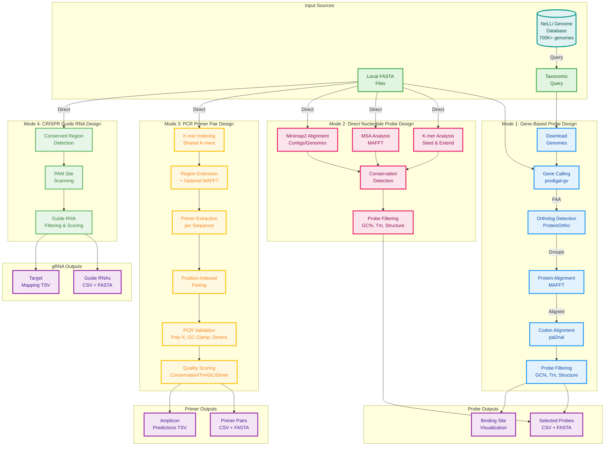

# PPDesign - Probe and Primer Design Pipeline

[](https://pixi.sh)
[](https://github.com/yourusername/ppdesign/releases)
[](https://www.python.org)
[](https://opensource.org/licenses/MIT)

PPDesign is a modern bioinformatics pipeline for designing oligonucleotide probes, primers, and CRISPR guide RNAs targeting specific taxonomic groups. It offers multiple approaches: gene-based design using codon alignments, direct nucleotide-based design using k-mer analysis, and CRISPR guide RNA design for conserved regions.

## CLI Overview

- `ppdesign unified` (src/ppdesign/probedesign_unified.py): Gene-based probe/primer pipeline with gene calling, orthogrouping (ProteinOrtho), MAFFT protein alignments, and codon alignments. Use when you have genomes and want conserved gene-driven designs.
- `ppdesign nucleotide` (src/ppdesign/probedesign_nucleotide.py): Direct nucleotide pipeline (k-mer / MSA / minimap2) without gene calling. Use for amplicons, contigs, or when proteins aren't required.
- `ppdesign primer` (src/ppdesign/probedesign_primer.py): PCR primer pair design for amplifying conserved regions. Designs forward/reverse primer pairs with amplicon size control (100bp-2kb).
- `ppdesign grna` (src/ppdesign/probedesign_grna.py): CRISPR gRNA design on FASTA inputs (uses src/ppdesign/guide_rna_finder.py for algorithms, including perfect-coverage mode).
- `ppdesign select` (src/ppdesign/probedesign_seqselection.py): Post-process codon alignments to select oligos with GC/Tm/structure filters.
- `ppdesign rank` (src/ppdesign/probedesign_rank.py): Rank and visualize selected oligos against a reference genome.

Note: `guide_rna_finder.py` is a library used by `ppdesign grna`; it is not a CLI.

## Documentation

- `docs/overview.md` – high-level description of every PPDesign entry point.
- `docs/grna_pipeline.md` – detailed guide RNA workflow, including perfect coverage mode and recent algorithm safeguards.
- `docs/unified_pipeline.md` – gene-based design pipeline and external tool requirements.
- `docs/nucleotide_pipeline.md` – direct nucleotide design options and mismatch handling.
- `docs/primer_pipeline.md` – PCR primer pair design guide with alignment modes and degeneracy control.
- `docs/post_processing.md` – ranking and filtering utilities for downstream curation.
- `docs/results.md` – glossary of output files shared across pipelines.
- `docs/test_datasets.md` – rationale behind bundled smoke-test FASTA sets.
- `CHANGELOG.md` – release highlights for each published version.

### Flag Compatibility

- Prefer `--fasta-input` for single FASTA files or directories across CLIs where supported. For legacy parity, `--fasta-dir` remains available in `ppdesign nucleotide` and `ppdesign unified` (directory only). In `ppdesign grna`, `--fasta-dir` is deprecated; use `--fasta-input` instead.

### Top-level CLI

You can also use a single entry point with subcommands (requires editable install or PYTHONPATH):

```bash
# gRNA design
PYTHONPATH=src python -m ppdesign.cli grna main \
  --fasta-input tests/test.fna \
  --output-dir demo_grna

# Gene-based pipeline
PYTHONPATH=src python -m ppdesign.cli unified main \
  --db-query --taxonomy "g__Salmonella" \
  --conservation 0.5 \
  --output-dir demo_unified

# Direct nucleotide pipeline
PYTHONPATH=src python -m ppdesign.cli nucleotide main \
  --fasta-input path/to/amplicons \
  --method msa \
  --output-dir demo_nt
```

## Key Features

- **Four design modes**: Gene-based probes, direct nucleotide probes, PCR primer pairs, CRISPR guide RNAs
- **PCR primer pairs**: Amplicon size control (100bp-2kb), Tm matching, cross-dimer validation, optional MAFFT refinement
- **CRISPR guide RNAs**: SpCas9 PAM recognition (NGG/NAG), perfect-coverage mode, non-degenerate mode
- **Database integration**: Optional NeLLi genome database (set `PPDESIGN_DUCKDB_PATH`)
- **Conservation algorithms**: K-mer seeding, MSA-based conservation, codon-aware alignment
- **Filtering**: GC%, Tm, secondary structure, IUPAC degeneracy control
- **Multi-threaded** processing for large-scale analyses

## Pipeline Architecture



## Installation

### Using Pixi (Recommended)

```bash
# Clone the repository
git clone https://github.com/yourusername/ppdesign.git
cd ppdesign

# Install with pixi
pixi install

# Activate the environment
pixi shell
```

### Using pip

```bash
# Clone the repository
git clone https://github.com/yourusername/ppdesign.git
cd ppdesign

# Install in development mode
pip install -e ".[dev]"
```

## Running the CLI from Anywhere

PPDesign installs console entry points via `pyproject.toml`:

```bash
# Option 1: Editable install (recommended)
pip install -e .
ppdesign --help

# Option 2: Pixi environment
pixi install
~/.pixi/envs/<env-name>/bin/ppdesign grna --help
```

## DuckDB and Genome Database Support

The optional NeLLi genome query helpers in `ppdesign.genome_database` rely on a DuckDB catalog. By default the pipeline looks for
`/clusterfs/jgi/scratch/science/mgs/nelli/databases/nelli-genomes-db/resources/database/gtdb_genomes.duckdb`.
Set `PPDESIGN_DUCKDB_PATH` to point at your copy, or skip the database features when DuckDB is not installed—the code now raises a descriptive error instead of crashing. Pixi installs the `duckdb` Python package so local development matches production deployments.

## Troubleshooting

- **Missing binaries**: Ensure prodigal-gv, proteinortho, mafft, minimap2 are on `$PATH`. Pipelines perform pre-flight checks.
- **Optional primer deps**: MAFFT (for `--align-regions`), primer3-py (for hairpin/dimer ΔG). Install via conda/pip.
- **MAXGROUPS error**: `rm -rf .pixi/envs/default && pixi install`
- **Results path**: Outputs go to `results/<output_dir>`, not `results/results/<output_dir>`.
- **Memory issues**: Reduce `--threads`, use `--limit`, or `--cluster-threshold` to reduce input size.

## Usage

### Mode 1: Gene-Based Design (for bacteria and viruses)

Gene calling, ortholog detection, and probe design from codon alignments.
`--fasta-input` accepts both files and directories.

```bash
# Database query mode
ppdesign unified \
  --db-query \
  --taxonomy "g__Citrobacter" \
  --tax-level species \
  --conservation 0.3 \
  --threads 8 \
  --limit 10 \
  -o citrobacter_probes

# Local file mode
ppdesign unified \
  --fasta-input path/to/genomes/ \
  --conservation 0.3 \
  --threads 8 \
  -o my_probes
```

### Mode 2: Direct Nucleotide Design (no gene calling)

Conserved region detection directly from nucleotide sequences.
Three methods available: `kmer` (recommended for longer sequences), `msa` (MAFFT, best for short/similar sequences), and `minimap2` (for contigs/genomes).
`--fasta-input` accepts both files and directories.

```bash
# K-mer method (recommended for most cases)
ppdesign nucleotide \
  --fasta-input path/to/sequences/ \
  --method kmer \
  --kmer-size 20 \
  --conservation 0.8 \
  --gc-min 40 --gc-max 60 \
  --tm-min 55 --tm-max 65 \
  --threads 8 \
  -o nucleotide_probes

# MSA method (MAFFT alignment, best for sequences <1kb)
ppdesign nucleotide \
  --fasta-input path/to/amplicons/ \
  --method msa \
  --conservation 0.9 \
  --window-size 30 \
  --step-size 5 \
  -o amplicon_probes

# Minimap2 method (fast alignment for genomes/contigs)
ppdesign nucleotide \
  --fasta-input path/to/genomes/ \
  --method minimap2 \
  --conservation 0.8 \
  --threads 8 \
  -o genome_probes
```

### Mode 3: PCR Primer Pair Design

Forward/reverse primer pair design for PCR amplification of conserved regions.
See [docs/primer_pipeline.md](docs/primer_pipeline.md) for detailed algorithm documentation.

```bash
# Basic primer design
ppdesign primer main \
  --fasta-input sequences.fna \
  --output-dir primer_results \
  --conservation 0.8

# qPCR primers (strict Tm matching, short amplicons)
ppdesign primer main \
  --fasta-input qpcr_targets.fna \
  --output-dir qpcr_primers \
  --amplicon-min 80 --amplicon-max 150 \
  --tm-min 58 --tm-max 62 --tm-diff-max 2.0 \
  --conservation 0.9

# High-quality mode with MAFFT alignment refinement
ppdesign primer main \
  --fasta-input sequences.fna \
  --output-dir hq_primers \
  --align-regions \
  --max-degenerate-positions 1
```

Outputs in `results/<output_dir>/`: `primer_pairs.csv`, `primer_pairs.fasta`, `amplicon_predictions.tsv`, `summary.txt`.
Quality scoring: conservation 40%, Tm matching 30%, GC content 20%, cross-dimer 10%.

### Mode 4: CRISPR Guide RNA Design

SpCas9-compatible guide RNA design in conserved regions.
See [docs/grna_pipeline.md](docs/grna_pipeline.md) for detailed algorithm documentation.

```bash
# Basic guide RNA design
ppdesign grna main \
  --fasta-input tests/test.fna \
  --output-dir quick_test \
  --conservation 0.5

# Non-degenerate mode with required targets
ppdesign grna main \
  --fasta-input sequences/ \
  --output-dir results/ \
  --no-degenerate \
  --required-targets seq1 seq2 seq3 \
  --conservation 0.3

# Perfect coverage mode (ensure N guides per target)
ppdesign grna main \
  --fasta-input tests/test.fna \
  --output-dir results/perfect_coverage \
  --perfect-coverage \
  --min-coverage-per-target 2 \
  --max-total-grnas 20 \
  --conservation 0.3

# Combined: non-degenerate + GC filtering + clustering
ppdesign grna main \
  --fasta-input sequences.fna \
  --output-dir optimal_guides/ \
  --conservation 0.8 \
  --no-degenerate \
  --min-gc 45 --max-gc 55 \
  --cluster-threshold 0.9 \
  --perfect-coverage \
  --min-coverage-per-target 2
```

Outputs: `guide_rnas.csv`, `guide_rnas.fasta`, `target_mapping.tsv`, `summary.txt`.
Perfect coverage mode also produces `coverage_matrix.tsv` and `target_coverage_details.tsv`.

#### Validation and Visualization

```bash
# Validate guides against targets
pixi run validate-grna \
  --guide-csv results/my_output/guide_rnas.csv \
  --guide-fasta results/my_output/guide_rnas.fasta \
  --target-fasta tests/test.fna

# Thermodynamic analysis
pixi run validate-grna-thermo \
  --guide-csv results/my_output/guide_rnas.csv \
  --guide-fasta results/my_output/guide_rnas.fasta \
  --target-fasta tests/test.fna

# cDNA strand bias validation
pixi run validate-grna-cdna \
  --guide-csv results/guide_rnas/guide_rnas.csv \
  --guide-fasta results/guide_rnas/guide_rnas.fasta \
  --target-fasta input_sequences.fna \
  --output cdna_validation.json
```

#### Terminal MSA Viewer

```bash
pixi run msa-view --num 5 --targets 10          # Alignment overview
pixi run msa-align --id gRNA_0001 --max 20      # Detailed alignment
pixi run msa-mismatch --id gRNA_0001 --mismatches 2  # Mismatch view
pixi run msa-stats                               # Statistics
pixi run msa-compare --ids "gRNA_0001,gRNA_0002" # Compare guides
pixi run msa-consensus --num 3                   # Consensus view
```

### Post-Processing Tools

#### Oligonucleotide Selection and Filtering
```bash
ppdesign select \
  -i results/my_probes/codon_alignments \
  --gc-range 45 55 \
  --tm-range 58 62 \
  --length 20 25 \
  --window-size 25 \
  --step 5 \
  --threshold 0.8 \
  --threads 8
```

#### Probe Ranking and Visualization
```bash
ppdesign rank \
  -o results/my_probes/selected_oligos.csv \
  -g reference_genome.fna \
  -r results/my_probes/rankings
```

## Output Structure

All results are organized in the `results/` directory:

```
results/
└── your_run_name/
    │
    │  # Gene-based probe pipeline (ppdesign unified)
    ├── data/
    │   ├── fna/                    # Downloaded/input genomes
    │   ├── faa/                    # Protein sequences
    │   └── fnn/                    # Gene nucleotide sequences
    ├── proteinortho/               # Orthologous groups
    ├── alignments/                 # MAFFT alignments
    ├── codon_alignments/           # Codon alignments
    ├── selected_oligos.csv         # Final probe designs
    ├── conserved_regions.txt       # Detailed conservation info
    │
    │  # Primer pair pipeline (ppdesign primer)
    ├── primer_pairs.csv            # Primer pair details and metrics
    ├── primer_pairs.fasta          # Primer sequences for synthesis
    ├── amplicon_predictions.tsv    # Predicted amplicon positions
    ├── summary.txt                 # Human-readable statistics
    │
    │  # Guide RNA pipeline (ppdesign grna)
    ├── guide_rnas.csv              # Guide RNA details and scores
    ├── guide_rnas.fasta            # Guide sequences in FASTA format
    ├── target_mapping.tsv          # Detailed target positions
    └── summary.txt                 # Analysis summary
```

## Advanced Parameters

### Conservation Levels
- `0.3` (30%): Low conservation, more degenerate probes
- `0.5` (50%): Moderate conservation, balanced specificity
- `0.8` (80%): High conservation, specific probes

### Thermodynamic Parameters
- **GC Content**: 40-60% (optimal for PCR)
- **Melting Temperature**: 55-65°C (standard PCR conditions)
- **Probe Length**: 18-25bp (optimal for specificity)

### Secondary Structure Checks
- **Hairpin ΔG**: > -3.0 kcal/mol
- **Self-dimer ΔG**: > -6.0 kcal/mol

## Development

### Running Tests
```bash
# Install the development feature once to get pytest, mypy, ruff, etc.
pixi install -e dev

# Run the full test suite (uses the dev environment)
pixi run -e dev test
```

### Code Quality
```bash
pixi run -e dev lint       # Run linters
pixi run -e dev format     # Format code
pixi run -e dev type-check # Type checking
```

### Building Documentation
```bash
pixi run docs       # Serve locally
pixi run build-docs # Build static
```

## Project Structure

```
ppdesign/
├── src/ppdesign/          # Source code
│   ├── probedesign_unified.py      # Mode 1: Gene-based probe design
│   ├── probedesign_nucleotide.py   # Mode 2: Direct nucleotide probe design
│   ├── probedesign_primer.py       # Mode 3: PCR primer pair design
│   ├── probedesign_grna.py         # Mode 4: CRISPR guide RNA design
│   ├── primer_types.py             # Primer/PrimerPair data classes
│   ├── primer_candidates.py        # Forward/reverse primer generation
│   ├── primer_pairing.py           # Position-indexed primer pairing
│   ├── primer_validation.py        # PCR best practices validation
│   ├── primer_scoring.py           # Primer pair quality scoring
│   ├── primer_output.py            # CSV/FASTA/TSV output writers
│   ├── guide_rna_finder.py         # Guide RNA core algorithms
│   ├── conserved_finder.py         # Conservation algorithms (k-mer + MAFFT)
│   ├── genome_database.py          # NeLLi database interface
│   ├── probedesign_seqselection.py # Oligo filtering
│   ├── probedesign_rank.py         # Ranking & visualization
│   ├── kmer_finder.py              # K-mer utilities
│   └── output_utils.py             # Shared output directory helper
├── tests/                 # Test suite
├── docs/                  # Documentation
├── examples/              # Example data
├── resources/             # Resources
├── results/              # Output directory (gitignored)
├── pixi.toml             # Environment config
├── pyproject.toml        # Package config
└── README.md             # This file
```

## Contributing

Contributions are welcome! Please feel free to submit a Pull Request.

## License

This project is licensed under the MIT License - see the LICENSE file for details.

## Citation

If you use PPDesign in your research, please cite:

```bibtex
@software{ppdesign2024,
  title = {PPDesign: A Modern Pipeline for Oligonucleotide Probe and Primer Design},
  year = {2024},
  url = {https://github.com/yourusername/ppdesign}
}
```
