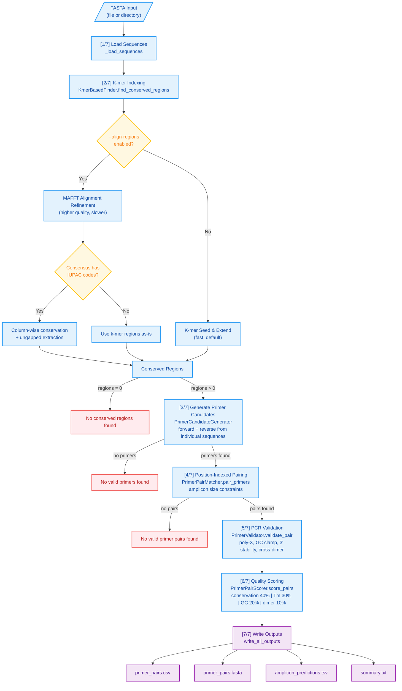

# PCR Primer Pair Design (`ppdesign primer`)

Design forward and reverse primer pairs for PCR amplification of conserved regions across multiple sequences.

## Overview

The primer pair design pipeline finds conserved regions in your input sequences and generates optimized primer pairs that:
- Amplify regions of specified size (100bp to 2kb)
- Have matched melting temperatures (within 5°C by default)
- Meet GC content requirements (40-60% by default)
- Avoid problematic secondary structures
- Maximize conservation across target sequences

## Workflow

1. **Load sequences** - Parse FASTA input (file or directory)
2. **Find conserved regions** - Use k-mer analysis to identify conserved blocks
3. **Generate primer candidates** - Extract forward and reverse primers from conserved regions
4. **Pair primers** - Match primers within amplicon size constraints using position indexing
5. **Validate pairs** - Check for poly-X runs, GC clamp, 3' stability, cross-dimers
6. **Score and rank** - Calculate quality scores (0-100) and sort by best to worst



## Key CLI Flags

| Flag | Default | Description |
|------|---------|-------------|
| `--fasta-input` | *required* | Input FASTA file or directory |
| `--output-dir` | *required* | Output directory (absolute or relative) |
| `--amplicon-min` | 100 | Minimum amplicon size (bp) |
| `--amplicon-max` | 2000 | Maximum amplicon size (bp) |
| `--min-length` | 18 | Minimum primer length (bp) |
| `--max-length` | 25 | Maximum primer length (bp) |
| `--tm-min` | 55.0 | Minimum melting temperature (°C) |
| `--tm-max` | 65.0 | Maximum melting temperature (°C) |
| `--tm-diff-max` | 5.0 | Maximum Tm difference between pairs (°C) |
| `--gc-min` | 40.0 | Minimum GC content (%) |
| `--gc-max` | 60.0 | Maximum GC content (%) |
| `--conservation` | 0.8 | Minimum conservation (0-1) |
| `--kmer-size` | 20 | K-mer size for conserved region finding |
| `--align-regions` | False | Use MAFFT for nucleotide-level alignment (requires MAFFT) |
| `--max-degenerate-positions` | 2 | Max IUPAC degenerate positions per primer (0-5) |
| `--threads` | 4 | Number of threads for parallel processing |

## Usage Examples

### Basic Primer Design

```bash
ppdesign primer main \
  --fasta-input sequences.fna \
  --output-dir my_primers \
  --conservation 0.8
```

### qPCR Primers (Strict Parameters)

```bash
ppdesign primer main \
  --fasta-input qpcr_targets.fna \
  --output-dir qpcr_primers \
  --amplicon-min 80 \
  --amplicon-max 150 \
  --tm-min 58 \
  --tm-max 62 \
  --tm-diff-max 2.0 \
  --gc-min 45 \
  --gc-max 55 \
  --conservation 0.95
```

### Long-Read Amplicons

```bash
ppdesign primer main \
  --fasta-input genomes.fna \
  --output-dir longread_primers \
  --amplicon-min 1500 \
  --amplicon-max 2000 \
  --conservation 0.7
```

### Low-Conservation Targets

```bash
ppdesign primer main \
  --fasta-input diverse_sequences.fna \
  --output-dir diverse_primers \
  --conservation 0.5 \
  --tm-min 52 \
  --tm-max 68
```

### High-Quality Mode (with Alignment)

For highest quality primers when sequences have variation, enable MAFFT alignment:

```bash
ppdesign primer main \
  --fasta-input sequences.fna \
  --output-dir high_quality_primers \
  --align-regions \
  --max-degenerate-positions 1 \
  --conservation 0.8
```

**When to use `--align-regions`:**
- Sequences have indels or complex variation patterns
- Want highest quality primer sites
- Can afford slightly slower processing (requires MAFFT)
- Need column-wise conservation metrics

**When NOT to use `--align-regions`:**
- Sequences are highly similar (>95% identity)
- Speed is critical (fast mode is 10-100× faster)
- MAFFT not installed
- Default k-mer mode works well enough

## Output Files

All results are saved to `results/<output_dir>/`:

### primer_pairs.csv

Comma-separated values with detailed metrics for each primer pair:

| Column | Description |
|--------|-------------|
| pair_id | Unique identifier (pair_001, pair_002, ...) |
| forward_seq | Forward primer sequence (5' to 3') |
| forward_tm | Forward primer melting temperature (°C) |
| forward_gc | Forward primer GC content (%) |
| forward_pos | Forward primer start position (0-based) |
| forward_strand | Forward primer strand (+) |
| reverse_seq | Reverse primer sequence (5' to 3', reverse complement) |
| reverse_tm | Reverse primer melting temperature (°C) |
| reverse_gc | Reverse primer GC content (%) |
| reverse_pos | Reverse primer binding site position (0-based) |
| reverse_strand | Reverse primer strand (-) |
| amplicon_size | Predicted amplicon size (bp) |
| tm_difference | Tm difference between primers (°C) |
| cross_dimer_score | Cross-dimer complementarity score |
| quality_score | Composite quality score (0-100) |
| conservation | Average conservation of both primers (0-1) |

### primer_pairs.fasta

FASTA format suitable for primer synthesis vendors:

```
>pair_001_forward
ATGCGATCGATCGATCGATCGTA
>pair_001_reverse
AGCTAGCTAGCTAGCTAGCTAGCT
>pair_002_forward
GCTAGCTAGCTAGCTAGCT
>pair_002_reverse
TCGATCGATCGATCGATCG
```

### amplicon_predictions.tsv

Tab-separated values showing predicted amplicons:

| Column | Description |
|--------|-------------|
| pair_id | Primer pair identifier |
| amplicon_start | Start position on forward strand |
| amplicon_end | End position on forward strand |
| amplicon_size | Size in base pairs |
| target_sequences | Comma-separated list of target IDs |

### summary.txt

Human-readable summary with statistics and top 10 primer pairs:

```
Primer Pair Design Summary
==================================================

Total primer pairs: 360

Amplicon Size Statistics:
  Range: 100-450 bp
  Mean: 275.3 bp

Tm Difference Statistics:
  Range: 0.1-4.9°C
  Mean: 2.1°C

Conservation Statistics:
  Range: 80.0%-100.0%
  Mean: 92.5%

Top 10 Primer Pairs (by quality score):
--------------------------------------------------
1. Quality: 98.2, Amplicon: 250bp, Conservation: 100.0%, ΔTm: 0.1°C
2. Quality: 97.8, Amplicon: 280bp, Conservation: 95.0%, ΔTm: 0.5°C
...
```

## Quality Scoring

Each primer pair receives a quality score from 0-100 based on four components:

### Conservation (40 points)
- Higher conservation = more sequences targeted
- Perfect conservation (100%) = 40 points
- Calculated as average of forward and reverse primer conservation

### Tm Matching (30 points)
- Closer Tm values = more balanced amplification
- Zero difference = 30 points
- Maximum penalty at 5°C difference (0 points)

### GC Content (20 points)
- Target: 50% GC for optimal stability
- Exact 50% = 20 points
- Further from 50% = lower score

### Cross-Dimer (10 points)
- Lower complementarity = better specificity
- No complementarity = 10 points
- Maximum penalty at 10+ complementary bases (0 points)

## Validation Rules

### Single Primer Validation

Each primer is checked for:

1. **Sequence composition**: Valid IUPAC codes, degenerate positions ≤ max_degenerate_positions
2. **Poly-X runs**: No more than 4 identical consecutive bases
3. **3' GC clamp**: At least one G or C in last 5 bases
4. **3' stability**: No more than 2 A or T in last 3 bases

### Primer Pair Validation

Each pair is checked for:

1. **Individual validation**: Both primers must pass single primer checks
2. **Cross-dimer score**: Must be ≤8 complementary bases
3. **Amplicon size**: Must be within specified min/max range
4. **Tm difference**: Must be within specified maximum (default 5°C)

## Algorithm Details

### Two-Stage Region Finding

The pipeline uses a hybrid approach for finding conserved regions:

#### Stage 1: K-mer Based Search (Fast, Default)

1. **Build k-mer index** - Extract all 20bp k-mers from each sequence
2. **Find shared k-mers** - Identify k-mers present in ≥80% of sequences
3. **Extend k-mers** - Grow regions left and right while conservation maintained
4. **Extract primers** - Generate candidates from individual sequences (not consensus)

**Performance**: O(n×m×k) where n=sequences, m=length, k=kmer size
**Typical runtime**: <1 second for 10 sequences of 5kb each

#### Stage 2: MAFFT Alignment (Optional, High Quality)

When `--align-regions` is enabled:

1. **K-mer search** - Use fast k-mer method to identify candidate regions
2. **MAFFT alignment** - Align sequences within each region
3. **Column-wise conservation** - Calculate conservation per alignment column
4. **Extract ungapped segments** - Extract conserved, ungapped regions for primers

**Performance**: O(n²×m) for MAFFT alignment
**Typical runtime**: 5-30 seconds for 10 sequences of 5kb each

**Benefits of alignment refinement:**
- Handles indels correctly
- More accurate conservation metrics
- Better primer site selection in variable regions
- Removes low-quality edge regions

**Tradeoffs:**
- 10-100× slower than k-mer only
- Requires MAFFT installation
- May filter out some regions found by k-mer method

### Primer Extraction Strategy

**Changed in v0.11.0**: Primers are now extracted from **individual sequences** instead of consensus:

**Before (v0.10.x)**:
```
Region consensus: ATGCRATCG  (R = A/G)
Primers extracted: NONE (consensus has IUPAC code)
```

**After (v0.11.0)**:
```
Region sequences:
  seq1: ATGCAATCG
  seq2: ATGCGATCG
Primers extracted:
  - ATGCAATCG (from seq1)
  - ATGCGATCG (from seq2)
```

**Benefits**:
- More primer candidates per region
- Handles regions with IUPAC codes gracefully
- Still validates as ACGT-only (or allows 1-2 IUPAC codes with `--max-degenerate-positions`)

### Degeneracy Control

The `--max-degenerate-positions` parameter controls IUPAC code tolerance:

| Value | Allowed | Use Case |
|-------|---------|----------|
| 0 | Strict ACGT only | Highest specificity, standard PCR |
| 1-2 | Minimal degeneracy | Good balance (default: 2) |
| 3-5 | Flexible | Highly variable targets, broader coverage |

**Validation**:
- Counts non-ACGT IUPAC codes (R, Y, M, K, S, W, B, D, H, V, N)
- Rejects primers exceeding threshold
- All IUPAC codes must be valid

### Position-Based Pairing (O(N) Performance)

Instead of checking all forward-reverse combinations (O(N²)), the algorithm:

1. **Indexes reverse primers by position** - O(N) preprocessing
2. **For each forward primer**:
   - Calculate valid position range for reverse primers
   - Look up only reverse primers in that range
3. **Result**: Linear time complexity instead of quadratic

Example:
- 100 forward × 100 reverse primers
- Naive approach: 10,000 comparisons
- Position-indexed: ~1,000 comparisons (10× faster)

### Thermodynamic Calculations

**Melting Temperature (Tm)**:
- Uses BioPython `MeltingTemp.Tm_NN` (nearest-neighbor method)
- Standard PCR conditions: 50 mM Na+, 250 nM primer concentration
- More accurate than simple GC-content formulas

**Hairpin/Dimer ΔG** (optional):
- Uses `primer3-py` library if installed
- Calculates free energy (ΔG) in kcal/mol
- Negative values indicate stable structures (problematic)
- Falls back gracefully if primer3-py not available

## Coordinate System

- **0-based, inclusive** start positions
- **Forward primers**: stored as-is, position = start on forward strand
- **Reverse primers**: stored as reverse-complement, position = binding site end on forward strand
- **Amplicon size**: reverse.position - forward.position

Example:
```
Forward strand:  5'---[FWD]===============[REV]---3'
                     ^pos=0             ^pos=250

Amplicon: 250 - 0 = 250 bp
```

## Troubleshooting

### No conserved regions found

**Problem**: Pipeline exits at step 2 with "No conserved regions found"

**Solutions**:
- Lower `--conservation` threshold (try 0.6 or 0.5)
- Decrease `--kmer-size` (try 15 or 18)
- Try `--align-regions` if sequences have indels or complex variation
- Check input sequences are in correct format (DNA, not protein)

### No valid primers generated

**Problem**: Pipeline exits at step 3 with "No valid primers found"

**Solutions**:
- Relax Tm constraints: widen `--tm-min` and `--tm-max` range
- Relax GC constraints: widen `--gc-min` and `--gc-max` range
- Lower `--conservation` to find more candidate regions
- Increase `--max-degenerate-positions` to allow more variation (try 3-5)
- Try `--align-regions` for better region quality

### No valid primer pairs found

**Problem**: Pipeline exits at step 4 with "No valid primer pairs found"

**Solutions**:
- Adjust `--amplicon-min` and `--amplicon-max` range
- Increase `--tm-diff-max` (try 8.0 or 10.0)
- Check that conserved regions are long enough for desired amplicon size

### Low quality scores

**Problem**: All primer pairs have quality scores <50

**Solutions**:
- This is often expected with low-conservation or difficult targets
- Focus on pairs with highest scores even if <50
- Validate top pairs experimentally
- Consider degenerate primers if variation is high

## Comparison with Other Modes

| Feature | Primer Mode | Probe Mode (nucleotide) | gRNA Mode |
|---------|-------------|------------------------|-----------|
| **Output** | Forward/reverse pairs | Single oligonucleotides | Single guide RNAs |
| **Application** | PCR amplification | Hybridization probes | CRISPR editing |
| **Length** | 18-25 bp each | 15-30 bp | 20 bp |
| **Pairing** | Yes (forward + reverse) | No | No |
| **Tm matching** | Critical | Not applicable | Not applicable |
| **Cross-dimer** | Checked | Not applicable | Not applicable |
| **Amplicon size** | 100-2000 bp | Not applicable | Not applicable |

## Best Practices

1. **Start with defaults**: The default parameters work well for most applications
2. **Adjust gradually**: Change one parameter at a time to see effects
3. **Choose appropriate mode**:
   - **Fast mode (default)**: Highly similar sequences (>95% identity), speed critical
   - **Alignment mode (`--align-regions`)**: Variable sequences, indels present, highest quality needed
4. **Control degeneracy**:
   - `--max-degenerate-positions 0`: Strict ACGT only (highest specificity)
   - `--max-degenerate-positions 2`: Default, allows minimal variation
   - `--max-degenerate-positions 5`: Highly variable targets, broader coverage
5. **Validate experimentally**: Top scoring pairs are predictions - test in lab
6. **Check coverage**: Review `amplicon_predictions.tsv` to see which targets are covered
7. **Use appropriate amplicon size**:
   - qPCR: 80-150 bp
   - Standard PCR: 200-800 bp
   - Long-read sequencing: 1000-2000 bp

## Installation Requirements

### Required
- Python 3.8+
- BioPython (for sequence handling and Tm calculation)

### Optional
- **MAFFT**: Required for `--align-regions` mode
  - Ubuntu/Debian: `sudo apt install mafft`
  - macOS: `brew install mafft`
  - Conda: `conda install -c bioconda mafft`
- **primer3-py**: For hairpin/dimer ΔG calculations
  - pip: `pip install primer3-py`

## References

- Primer design principles: Dieffenbach & Dveksler (2003) "PCR Primer"
- Tm calculation: SantaLucia (1998) PNAS 95:1460-1465
- K-mer conservation: Edgar (2004) Nucleic Acids Res 32:1792-1797
